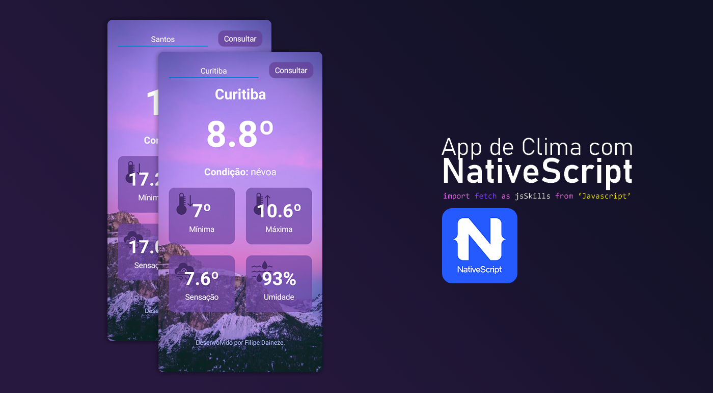

   
# Weather App - Nativescript
Aplicativo de consulta de clima com consulta a API OpenWeather, criado para teste de desenvonvimento no NativeScript



## Links

- [NativeScript and Vue.js](https://nativescript.org/vue/)
- [Make Http Request in NativeScript Vue](https://nativescript.org/blog/make-http-requests-to-remote-web-services-in-a-nativescript-vue-app/)
- [Open Weather API](https://openweathermap.org/api)

## Modo de uso
Ao terminar de realizar o download, utilize o comando abaixo para instalar o pacote NativeScript CLI:
``` bash
$ npm install -g nativescript@latest
```

E para rodar o aplicativo, use o comando
``` bash
$ tns preview
# ou
$ tns run
```